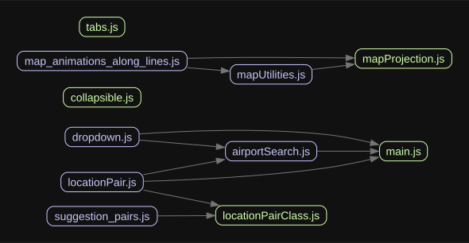

# Great Circle Mapper

The Great Circle Mapper is a web application designed to help users visualize the shortest distance between two airports on the Earth's surface, also known as a great circle. This tool is useful for pilots, travelers, and anyone interested in geography and aviation.

## Features

- Search for airports by country and airport code.
- Add pairs of airports to visualize the great circle path between them.
- View suggested pairs of airports.
- Data is persisted in the browser's local storage, so your added pairs will still be there when you come back!
- Switch between a range of map projections and an orthographic Globe view.
- Expand a route to highlight its Great Circle; where available, view real-flight median corridor overlays.

## Usage

To use the Great Circle Mapper, simply select two airports from the dropdown menus and click the "Add" button. The great circle path between the two airports will be displayed on the map. You can also click the "Suggestions" button to see some interesting pre-selected pairs of airports.

## Project Structure

This project is structured as a modular JavaScript application. The main dependencies between modules are illustrated in the following diagram:



### Technical documentation

- [Map projection and globe lifecycle](docs/map-projection-lifecycle.md) — rendering architecture, state-preservation rules, and centering regressions.
- [Flight corridor data](docs/flight-corridor-data.md) — acquisition, processing, provenance, and frontend rendering of real-flight median routes.

## Testing

Run the browser UI and map-lifecycle regressions:

```bash
npm run test:ui -- --reporter=line
```

Run the flight-corridor processing tests:

```bash
npm test --prefix tools/corridors
```

## Future Improvements

- Add map projections in a responsibe accordion format

## Contributing

This is a hobby project and contributions are not currently being accepted. However, feel free to fork the repository and make your own improvements!

## License

This project is licensed under the MIT License.
